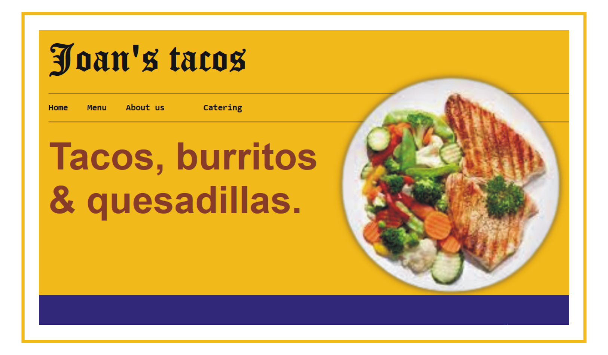

# Simple-Catering-Service-Home-Page
### A Basic catering service home page made with Html and CSS
#### Went back memory lane to dig up one of my old designs. From a professional point of view, mistakes could be spotted in the CSS code as Position should not be used to move objects around in web designs as it might affect the overall function.

<a href='https://topmark1.github.io/Simple-Table-Design/'>
</img>
</a>

##### what I like most about this design is the sticky bottom effect present there. Overall we keep unlearning and learning.
